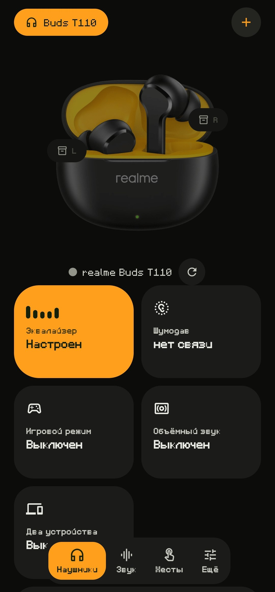
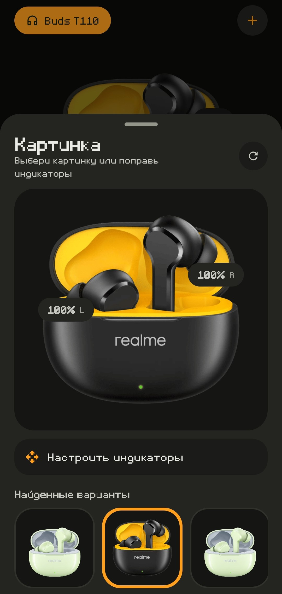

# Buds Control

**Читать на других языках:**
[English](https://translate.google.com/translate?sl=ru&tl=en&u=https://github.com/aezochka/buds-control) ·
[Українська](https://translate.google.com/translate?sl=ru&tl=uk&u=https://github.com/aezochka/buds-control) ·
[Deutsch](https://translate.google.com/translate?sl=ru&tl=de&u=https://github.com/aezochka/buds-control) ·
[Español](https://translate.google.com/translate?sl=ru&tl=es&u=https://github.com/aezochka/buds-control) ·
[Polski](https://translate.google.com/translate?sl=ru&tl=pl&u=https://github.com/aezochka/buds-control) ·
[Türkçe](https://translate.google.com/translate?sl=ru&tl=tr&u=https://github.com/aezochka/buds-control) ·
[中文](https://translate.google.com/translate?sl=ru&tl=zh-CN&u=https://github.com/aezochka/buds-control)

Своё приложение для наушников realme, OPPO и OnePlus — вместо realme Link.
Без аккаунта, без рекламы, без слежки.

<p align="left">
  
  
</p>

## Что оно делает

Говорит с наушниками напрямую по Bluetooth, их же протоколом:

- показывает заряд каждого наушника и кейса
- переключает шумодав: выкл → шумодав → прозрачность
- включает игровой режим
- грузит кривую эквалайзера прямо в наушники
- настраивает жесты, отдельно для левого и правого
- ищет наушники звуком, если потерялись
- показывает версию прошивки
- объёмный звук и подключение к двум устройствам

**Кнопки появляются сами.** При подключении приложение спрашивает у наушников,
что они умеют, и рисует только это. Так же делает родное приложение. Поэтому
на модели с шумодавом кнопки появятся без единой правки в коде, а на T110 не
будет висеть то, чего в них физически нет.

Пока идёт подключение — показывается всё. Функция прячется только когда
наушники ответили и про неё не сказали.

**Каталог моделей** — 33 модели с их функциями, поиск по названию модели или по
функции. Данные вытащены из конфигов realme Link.

Что умеет сам телефон:

- эквалайзер через Android, если наушники свой не поддержали
- лимит громкости — держится, даже если жать кнопки громкости
- таймер сна с обратным отсчётом и уведомлением

Про интерфейс:

- Material 3 Expressive: пружины, морф иконок, без стандартного ripple
- 12 акцентов плюс свой цвет
- фото наушников подбирается само по имени Bluetooth-устройства, фон вырезается
- индикаторы заряда встают рядом с наушниками на фото, положение и размер
  можно поправить руками
- несколько наушников в профилях, порядок меняется перетаскиванием
- 8 языков, переключаются сразу
- щелчки и вибро на нажатия, отключаются
- обновление одной строкой: скачанный файл не качается заново, оборванная
  загрузка продолжается с того же места
- если приложение упало — появится отчёт о сбое, копируется одной кнопкой

## Поставить

Скачай APK из [релизов](../../releases/latest).

Подпись всегда одна, так что новая версия встаёт поверх старой, удалять не надо.
Дальше обновляться можно из самого приложения: **Ещё → Обновление**.

## Собрать

Сборка идёт через GitHub Actions — воркфлоу `.github/workflows/build.yml` сам
собирает, подписывает и выкладывает APK.

Локально, если есть Android SDK и JDK 17:

```bash
./gradlew :app:assembleRelease
```

Ключ подписи в репозитории не хранится. Для локальной сборки задайте
параметры в `local.properties`:

```properties
keystore.file=/путь/к/ключу.jks
keystore.password=...
keystore.alias=buds
keystore.keyPassword=...
```

CI подписывает релизы ключом из Secrets (`KEYSTORE_BASE64`, `KEYSTORE_PASSWORD`,
`KEY_ALIAS`, `KEY_PASSWORD`). Без ключа релиз собирается debug-подписью.
Релизы публикуются по тегу `v*`, а не на каждый пуш в main.

## Что просит у телефона

| Разрешение | Зачем |
|---|---|
| `BLUETOOTH_CONNECT`, `BLUETOOTH_SCAN` | связаться с наушниками и найти их |
| `INTERNET` | подобрать фото и проверить обновление |
| `POST_NOTIFICATIONS` | уведомление таймера сна |
| `MODIFY_AUDIO_SETTINGS` | системный эквалайзер |
| `REQUEST_INSTALL_PACKAGES` | поставить обновление |
| `VIBRATE` | отклик на нажатие |

Микрофон, геолокация и файлы **не запрашиваются вообще**.

## Как это работает внутри

Наушники слушают SPP/RFCOMM, кадры начинаются с `0xAA`. Базу взяли из открытого
[Gadgetbridge](https://codeberg.org/Freeyourgadget/Gadgetbridge).

Эквалайзер и опрос возможностей нашли, разобрав realme Link через jadx
(модуль `realmeHeadset.apk`):

| Что | Команда |
|---|---|
| Что умеет модель | `0x0100`, ответ `0x8100` |
| Кривая эквалайзера | `0x0418` |
| Включить эквалайзер | `0x0406` |
| Шумодав | `0x0404` |
| Найти наушники | `0x0400` |

Кадр эквалайзера:

```
[0] действие (0 — записать, 5 — спросить)
[1] мин. дБ  [2] макс. дБ  [3] id кривой  [4] длина имени
    сколько полос, дальше на каждую: частота (2 байта LE) + усиление (1 байт)
```

Частоты идут прямо в кадре, поэтому кривая любая, а не пять фиксированных полос.

## Чего тут нет и почему

- **Усиление громкости и пресеты звука** (Bass Boost+, Баланс, Чёткий) на T110
  живут в другом протоколе — `wm/spplibrary`, атрибут `26`. Там шифрованное
  рукопожатие, наугад делать не стал.
- **Названий моделей** в realme Link нет: они грузятся с сервера
  `client-uc.heytapmobi.com`, а он закрыт и подписывает запросы. Поэтому в
  каталоге честно `modelId`, а не выдуманные имена.
- **Докачки обновлений по частям**, как в Play Store, для APK не бывает: Android
  ставит только целый подписанный файл. Что можно — сделано: докачка с обрыва и
  повторное использование уже скачанного.

## На чём проверено

realme Buds T110. Другие наушники на этом протоколе должны работать сразу —
набор кнопок берётся из ответа самих наушников.

Железом подтверждено: подключение, заряд, игровой режим, жесты, прошивка.
Эквалайзер в наушниках и шумодав написаны по протоколу из родного приложения, но
на модели без этих функций их не проверить — приложение считает функцию рабочей
только после ответа наушников.

## Автор

Telegram: [@rz3nx](https://t.me/rz3nx)

## Лицензия

GPL-3.0 — код открыт, форки обязаны оставаться открытыми. Текст: [LICENSE](LICENSE).
