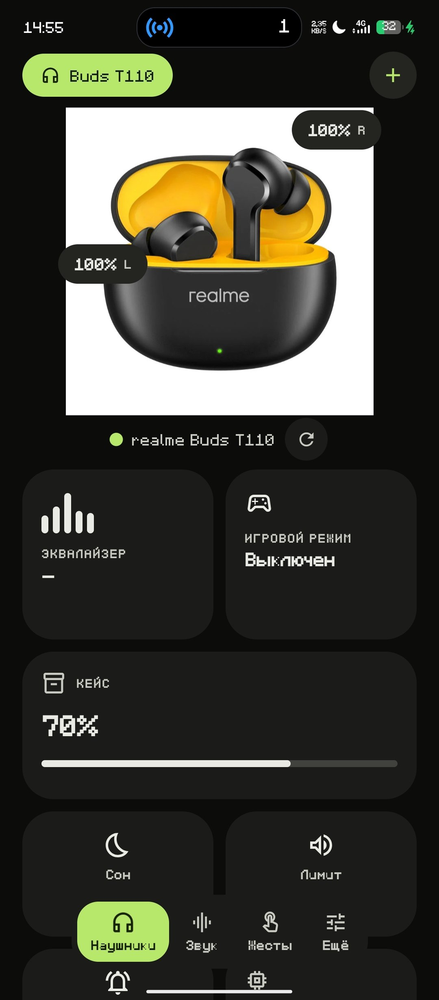
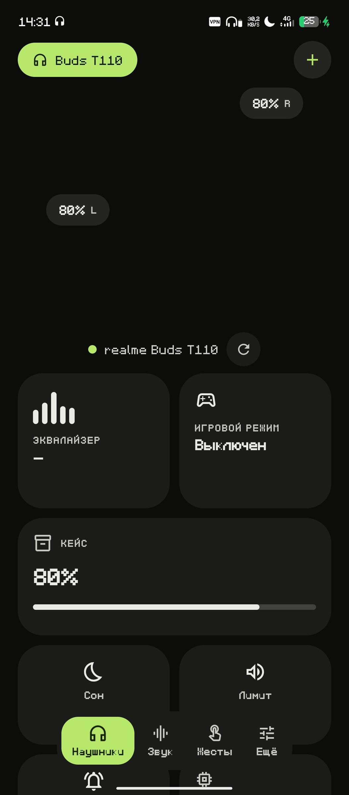
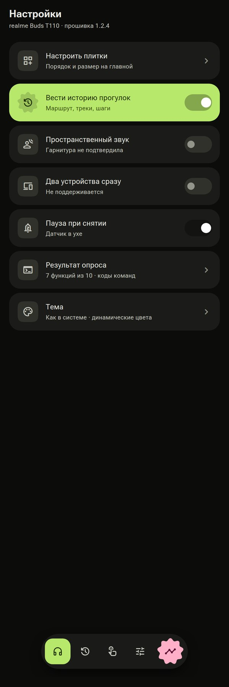

# Buds Control

Приложение для управления TWS-наушниками на протоколе OPPO / realme / OnePlus.
Замена realme Link: без аккаунта, без рекламы, без телеметрии.

<p align="left">
  
  
  
</p>

## Что умеет

**По протоколу гарнитуры** (Bluetooth Classic SPP, кадры `0xAA`):

- Заряд левого, правого наушника и кейса
- Игровой режим низкой задержки
- Жесты: отдельно для левого и правого, действие выбирается из списка
- Версия прошивки
- Поиск наушников звуковым сигналом
- Пространственный звук и подключение к двум устройствам, если модель их поддерживает

Возможности определяются **опросом в рантайме**: приложение спрашивает гарнитуру и
показывает только то, на что она ответила. Никаких мёртвых переключателей — если
функции нет, плитка честно неактивна.

**Системными средствами Android:**

- Эквалайзер: полосы читаются с устройства, применяется к выводу телефона
- Лимит громкости — держится, даже если громкость поднять кнопками
- Таймер сна со своим временем, обратным отсчётом и уведомлением

**Интерфейс:**

- Material 3 Expressive: пружинная физика, морф форм, без системного ripple
- 12 акцентов темы плюс свой цвет по RGB
- Фото наушников подбирается автоматически по имени Bluetooth-устройства,
  фон вырезается — работает для любой модели, не только realme
- Индикаторы заряда ставятся рядом с наушниками на фото: положение считается
  анализом самой картинки, вручную можно поправить и изменить размер
- Несколько профилей наушников, порядок меняется перетаскиванием
- Три языка: русский, английский, украинский. Переключается мгновенно
- Звуковые щелчки и вибро на действия, отключаются в настройках

## Установка

Готовый APK — во вкладке [Actions](../../actions): открой последнюю успешную сборку
и скачай артефакт `BudsControl-apk`.

Подпись постоянная, поэтому обновления ставятся поверх без удаления.

## Сборка

```bash
./gradlew :app:assembleRelease
```

Требуется JDK 17. Ключ подписи лежит в репозитории (`buds-release.jks`) —
это личный проект, не для публикации в Play.

## Разрешения

| Разрешение | Зачем |
|---|---|
| `BLUETOOTH_CONNECT`, `BLUETOOTH_SCAN` | связь с гарнитурой и поиск устройств |
| `INTERNET` | автоподбор фото наушников |
| `POST_NOTIFICATIONS` | уведомление таймера сна |
| `VIBRATE` | отклик при нажатии |

Микрофон, геолокация и доступ к файлам **не запрашиваются**.

## Протокол

Основа — открытая реализация из
[Gadgetbridge](https://codeberg.org/Freeyourgadget/Gadgetbridge):
`service/devices/oppo`. Кадры с префиксом `0xAA` поверх SPP/RFCOMM.

Важно: команды эквалайзера в этом протоколе **нет** — в нём только батарея,
прошивка, жесты, поиск устройства, ANC и четыре MISC-настройки. Поэтому
эквалайзер в приложении системный, а не гарнитурный.

## Проверено на

realme Buds T110. Любая другая модель на этом протоколе должна работать без
правок кода — набор функций определяется опросом.
